# 智能视频分析预警平台项目深度分析文档

> 源码路径：`D:\java\lianqian\code\code-for-vue\wsdc-znfx`  
> 面试项目名建议：重点场所智能视频分析预警平台 / 侦查分析后端重构项目  
> 核心主线：采集 -> 算法识别 -> 标准事实落库 -> 规则引擎判定 -> 正式告警 -> 业务处置

## 1. 项目背景

这个项目面向审讯室、接警大厅、服务窗口、枪库等重点场所，目标是把摄像头抓拍、AI 算法识别、业务规则判定和正式告警处置串成一条可运行、可扩展、可重放的后端链路。

从仓库文档和代码看，它不是从零新建的小系统，而是由多个旧项目重构收口而来。重构目标不是简单搬代码，而是把原来分散的采集、算法、规则、告警和业务配置能力整理成职责清晰的多模块工程，逐步完成标准化。

面试中可以这样开场：

> 我参与的是重点场所智能视频分析预警平台，核心是把多来源视频抓拍转换为算法事实，再通过场所规则引擎生成正式告警。项目难点不只是接口开发，而是多服务协同、算法结果标准化、规则运行态、任务幂等、缓存和可靠性兜底。

## 2. 项目全景扫描

### 2.1 一级模块

父工程包含 5 个一级模块：

| 模块 | 定位 | 职责 |
| --- | --- | --- |
| `znfx-shared-common` | 公共基础模块 | 公共 DTO、RabbitMQ 配置、数据库属性、HTTP SDK |
| `znfx-collection-service` | 采集服务 | 摄像头/平台抓图、海康配置同步、生成待分析任务 |
| `znfx-algorithm-service` | 算法编排服务 | 构建并领取分析任务、调度算法执行器、标准事实落库 |
| `znfx-rule-engine-service` | 规则引擎服务 | 扫描规则任务、构造规则上下文、维护运行态、生成告警 |
| `znfx-business-domain-service` | 业务域聚合工程 | 配置管理、告警网关、告警核验、海康/第三方接入 |

`znfx-business-domain-service` 下还有多个子模块：

| 子模块 | 说明 |
| --- | --- |
| `znfx-admin-web` | 业务域启动入口、开放接口、Liquibase、Actuator |
| `znfx-equipment-manage` | 场所、摄像头、点位角色、场所规则配置 |
| `znfx-analysis-strategy` | 算法注册、规则配置、规则业务条件 |
| `znfx-warning-verification` | 正式告警创建、核验、媒体追加、语音提醒 |
| `znfx-hik-platform` | 海康平台接入和历史视频能力 |
| `znfx-third-part` | 第三方接入适配 |
| `znfx-system-web` | 系统管理能力 |
| `znfx-business-common` / `znfx-common` | 业务公共能力 |

### 2.2 启动入口与端口

| 服务 | 启动类 | 默认端口 |
| --- | --- | --- |
| 采集服务 | `znfx-collection-service/src/main/java/com/lqxx/ZnfxCollectionApplication.java` | 以配置为准 |
| 算法服务 | `znfx-algorithm-service/src/main/java/com/lqxx/ZnfxAlgorithmApplication.java` | `8380` |
| 规则服务 | `znfx-rule-engine-service/src/main/java/com/lqxx/ZnfxRuleEngineApplication.java` | `8480` |
| 业务域服务 | `znfx-business-domain-service/znfx-admin-web/src/main/java/com/lqxx/ZnfxAdminWebApplication.java` | 常见为 `8081` |
| Python 算法服务 | `python/PythonAlgorithmService/app/main.py` | `18080` |

### 2.3 代码规模

排除 `target`、Python 虚拟环境和 `__pycache__` 后，源码静态扫描结果：

| 模块 | Java 文件 | Python 文件 | Controller | Service |
| --- | ---: | ---: | ---: | ---: |
| `znfx-shared-common` | 42 | 0 | 0 | 1 |
| `znfx-collection-service` | 61 | 0 | 1 | 9 |
| `znfx-algorithm-service` | 152 | 0 | 3 | 29 |
| `znfx-rule-engine-service` | 84 | 0 | 1 | 15 |
| `znfx-business-domain-service` | 613 | 0 | 75 | 107 |
| `python/PythonAlgorithmService` | 0 | 45 | - | - |

这些数字适合说明项目是多模块、多服务、跨语言协同的真实工程，不是单个演示接口。

## 3. 整体架构

```mermaid
flowchart LR
    A["采集服务<br/>摄像头/海康/统一视频平台"] --> B["待分析任务<br/>t_abnormal_record_temp"]
    B --> C["算法服务<br/>AnalysisTaskProcessService"]
    C --> D["算法执行器<br/>AlgorithmExecutor / Python FastAPI"]
    D --> E["标准事实<br/>t_analysis_record + t_analysis_target"]
    E --> F["规则任务<br/>rule_pending_task"]
    F --> G["规则引擎<br/>FactStreamRuleEngineService"]
    G --> H["正式告警<br/>t_abnormal_record_YYYY_MM"]
    H --> I["业务域<br/>告警展示/核验/通知"]
```

### 3.1 数据语义

| 层次 | 表/对象 | 语义 |
| --- | --- | --- |
| 待分析任务 | `t_abnormal_record_temp` | 素材已进入系统，等待算法分析 |
| 标准事实 | `t_analysis_record`、`t_analysis_target` | 算法输出的标准分析记录和目标级明细 |
| 历史兼容事实 | `t_abnormal_record` | 旧链路兼容、回退和部分历史展示 |
| 规则任务 | `rule_pending_task` | 规则引擎待处理事件，支持幂等、重试、死信 |
| 正式告警 | `t_abnormal_record_YYYY_MM`、`t_abnormal_meter` | 业务上真正形成的预警和证据附件 |

当前项目处于“新链路优先、旧链路兼容”的重构过渡期。标准事实模型已经落地，但历史事实表仍未完全下线。

### 3.2 技术栈

实际使用的技术栈：

| 方向 | 技术 |
| --- | --- |
| Java 后端 | Java 8、Spring Boot、Spring MVC |
| 持久层 | Spring Data JPA、MyBatis、MyBatis Plus |
| 数据库 | MySQL、Liquibase |
| 连接池 | HikariCP、Druid |
| 消息 | RabbitMQ |
| 缓存/状态 | Redis、Caffeine |
| 监控 | Spring Actuator、Micrometer、Prometheus endpoint |
| 算法 | JavaCV/OpenCV、ONNX Runtime GPU、InsightFace、YOLO、Pose、OCR |
| Python 服务 | FastAPI、Pydantic、OpenCV、onnxruntime-gpu |
| 第三方 | 海康平台、统一视频平台、MinIO、MQTT 配置等 |

源码未发现 Dubbo、Nacos、RocketMQ、Elasticsearch、Trantor 在本项目主链路中的落地证据。面试时应如实说明：本项目没有采用这些技术，而是用 HTTP、RabbitMQ、任务表和配置化地址完成服务协同。

## 4. 核心业务流程

### 4.1 采集流程

关键类：

- `CollectionTaskTriggerController`
- `CapturePictureService`
- `HikvisionConfigService`

采集服务负责把外部设备或平台素材转成系统待分析任务。它支持三类来源：

1. 统一视频平台：`GB28181SipPlatformSystem`
2. 海康 AI 平台：`HikvisionAICaptureSystem`
3. 直连 NVR：`GB28181NVRMonitorSystem`

`CollectionTaskTriggerController` 提供 `/open/task/capturePicture`、`/open/task/cleanCaptureHistory`、`/open/task/syncHikConfig` 等接口，并用 `AtomicBoolean` 防止长任务重复并发执行。

`CapturePictureService` 在启动后初始化线程池，按 `NORMAL`、`MAJOR`、`SPECIAL` 不同任务类型拆分处理，并通过 `Semaphore(50)` 控制抓图并发。数据库写入使用独立 `dbPool`，历史图片和 DB 数据通过清理配置定期处理。

业务价值：采集层屏蔽设备厂商差异，后续算法和规则只面对“待分析任务”，避免海康、NVR、GB28181 等差异扩散到全链路。

### 4.2 算法分析流程

关键类：

- `AlgorithmTaskTriggerController`
- `AnalysisTaskBuildService`
- `AnalysisTaskProcessService`
- `AlgorithmDispatchService`
- `StandardAnalysisPersistenceService`
- `AlgorithmExecutorRegistry`
- `RemoteAlgorithmExecutor`

核心步骤：

1. `AnalysisTaskBuildService` 将待分析记录转换为标准 `AnalysisTask`。
2. 使用确定性 ID 避免同一来源记录重复构建任务。
3. `AnalysisTaskProcessService` 通过 `claimToken` 领取任务。
4. 支持任务超时回收、重试、死信和多线程处理。
5. 用 `activeSourceImageIds` 避免同一图片被重复并发分析。
6. `AlgorithmDispatchService` 根据规则算法绑定和 `entryKey` 找执行器。
7. 执行器调用本地 Java 算法或远程 Python `/api/v1/analyze`。
8. `StandardAnalysisPersistenceService` 写入标准事实表。
9. 事务提交后创建规则任务并发送 RabbitMQ 事实事件。

算法服务关键配置：

| 配置 | 值 | 作用 |
| --- | ---: | --- |
| `analyse.pool.size` | `6` | 分析线程池 |
| `algorithm.analysis.fetch-limit` | `20` | 每轮拉取任务数 |
| `algorithm.analysis.consume.claim-limit` | `6` | 单轮领取上限 |
| `algorithm.analysis.task-timeout-seconds` | `600` | 任务超时 |
| `algorithm.analysis.backpressure.high-watermark` | `64` | 背压高水位 |
| `algorithm.analysis.backpressure.low-watermark` | `24` | 背压低水位 |
| `algorithm.yolo.global.max-concurrent-runs` | `3` | YOLO 全局并发 |
| `algorithm.dispatch.result-cache.ttl-ms` | `15000` | 结果缓存 TTL |
| `algorithm.dispatch.result-cache.max-size` | `2048` | 结果缓存容量 |

### 4.3 Python 算法服务

关键文件：

- `python/PythonAlgorithmService/app/main.py`
- `python/PythonAlgorithmService/app/api/v1/analyze.py`
- `python/PythonAlgorithmService/app/services/algorithm_router.py`
- `python/PythonAlgorithmService/docs/api-contract.md`

Python 服务提供统一 `/api/v1/analyze` 接口，由 `AlgorithmRouter` 根据 `algorithmCode` 路由到具体模型服务，支持人脸、YOLO、姿态、OCR 等能力。启动时通过 `warmup_algorithms` 预热模型，降低首次调用延迟。

这个边界非常适合面试：

- Java 负责稳定业务链路：任务、事务、幂等、事实落库、规则衔接。
- Python 负责算法生态：模型加载、GPU 推理、图片预处理、目标输出。
- 两者通过统一接口契约交互，降低模型升级对 Java 主链路的影响。

### 4.4 规则引擎流程

关键类：

- `RulePendingTaskTriggerController`
- `FactAnalysisEventReceiver`
- `RulePendingTaskProcessService`
- `FactStreamRuleEngineService`
- `PlaceRuntimeRuleContextService`
- `FactRuleEvaluationService`
- `RuleConditionEvaluationService`
- `RuleRuntimeStateStore`
- `StreamingWarningService`

规则引擎采用“RabbitMQ 触发 + DB 任务表兜底”的可靠处理模式。

`FactAnalysisEventReceiver` 监听：

- exchange：`znfx.fact.analysis.exchange`
- queue：`znfx.fact.analysis.queue`
- routing key：`fact.analysis.created`

但 MQ 只负责触发扫描，真正语义处理以 `rule_pending_task` 为准。任务表包含 `task_key`、`analysis_id`、`camera_id`、`place_id`、`rule_code`、`bucket_key`、`status`、`retry_count`、`claim_token`、`last_error` 等字段。

规则服务关键配置：

| 配置 | 值 | 作用 |
| --- | ---: | --- |
| `rule.pending.task.claimBatchSize` | `300` | 每批领取任务数 |
| `rule.pending.task.workerCount` | `6` | 处理线程 |
| `rule.pending.task.processingTimeoutMillis` | `300000` | 处理中超时 |
| `rule.pending.task.maxBatchCount` | `20` | 单轮最大批次数 |
| `rule.pending.task.maxProcessCount` | `3000` | 单轮最大处理数 |
| `rule.pending.task.maxRunMillis` | `60000` | 单轮最大耗时 |
| `rule.runtime.state.ttlSeconds` | `7200` | Redis 运行态 TTL |
| `rule.runtime.state.lockSeconds` | `30` | Redis 分桶锁时间 |
| `rule.runtime.state.lockAcquireTimeoutMillis` | `20000` | 锁获取超时 |

规则判断抽象为：

> 场所 + 点位角色 + 规则条件 + 标准事实 + 时间窗口 + 运行态

`RuleConditionEvaluationService` 支持 `COUNT`、`EXISTS`、`NOT_EXISTS`、`AND/OR`、身份、性别、行为、事件编码等过滤和聚合。

### 4.5 正式告警流程

关键类：

- `WarningOpenApiController`
- `WarningGatewayApplication`
- `WarnVerificationCommandFacadeImpl`
- `StreamingWarningService`

业务域提供统一开放告警入口：

- `POST /openapi/warnings/create`
- Header：`X-OPENAPI-TOKEN`
- 可选 Header：`X-TRACE-ID`、`X-ALARM-SOURCE`、`X-CHANNEL`

规则命中后，`StreamingWarningService` 负责解析场所、主点位、规则、开始/结束快照和证据快照，写入正式告警月表 `t_abnormal_record_YYYY_MM`，追加 `t_abnormal_meter` 证据附件，并发送告警通知 MQ。持续命中会追加证据，重复告警会被拦截或复用。

## 5. 关键技术点

### 5.1 微服务实践

项目没有使用完整 Spring Cloud、Dubbo 或 Nacos，但具备服务拆分实践：

1. 采集、算法、规则、业务域、Python 算法服务可独立启动。
2. 服务间通过 HTTP、RabbitMQ、数据库任务表和配置化地址协同。
3. 规则链路用 DB 任务表保证可重试、可补偿。
4. 算法服务与 Python 推理服务跨语言解耦。

可以这样回答：

> 本项目没有为了技术名词引入注册中心，而是在固定内网部署场景下采用任务表 + MQ 触发 + 配置化地址。优点是简单、可追溯、可重放；如果后续实例规模扩大，可以引入 Nacos 和服务治理组件。

### 5.2 缓存设计

| 缓存/状态 | 技术 | 作用 |
| --- | --- | --- |
| 热配置缓存 | Caffeine | 降低算法调度和绑定配置查询成本 |
| 结果缓存 | Caffeine/本地缓存 | TTL 15 秒、最大 2048，减少重复推理 |
| 规则运行态 | Redis | 保存连续异常和窗口状态，TTL 7200 秒 |
| 分桶锁 | Redis `SET NX EX` | 保证同一 `bucketKey` 的状态一致 |
| 模型预热 | Python startup | 降低首次推理延迟 |

缓存设计原则：

- 本地 Caffeine 用于短生命周期、读多写少、跨实例一致性要求不高的数据。
- Redis 用于跨实例共享的规则运行态和锁。
- 结果缓存 TTL 很短，用于降低重复推理，不承担长期事实语义。

### 5.3 性能优化

| 位置 | 优化手段 | 量化点 |
| --- | --- | --- |
| 采集服务 | 并发限流 | `Semaphore(50)` |
| 采集服务 | DB 写入隔离 | 独立 `dbPool` |
| 算法服务 | 分析线程池 | `analyse.pool.size=6` |
| 算法服务 | 背压控制 | 高水位 `64`、低水位 `24` |
| 算法服务 | YOLO 并发限制 | `max-concurrent-runs=3` |
| 算法服务 | 结果缓存 | TTL `15s`、最大 `2048` |
| 规则服务 | 批量领取 | `claimBatchSize=300` |
| 规则服务 | 并发处理 | `workerCount=6` |
| 规则服务 | 单轮上限 | `3000` 条或 `60s` |
| 业务域 | 连接池 | Druid `maxActive=50` |

### 5.4 可靠性与幂等

| 位置 | 设计 | 证据 |
| --- | --- | --- |
| 分析任务构建 | 确定性任务 ID | `AnalysisTaskBuildService` |
| 分析任务消费 | `claimToken` 领取 | `AnalysisTaskProcessService` |
| 标准事实落库 | `idempotency_key` 唯一 | `20260604-01-analysis-record-idempotency.xml` |
| 规则任务 | `task_key` 唯一 | `20260521-01-rule-pending-task.xml` |
| 规则消费 | 重试/死信/超时恢复 | `RulePendingTaskProcessService` |
| 规则运行态 | Redis TTL + 分桶锁 | `RuleRuntimeStateStore` |
| 事务后触发 | `afterCommit` | `StandardAnalysisPersistenceService` |

## 6. 数据流与调用链

### 6.1 自研分析链路

1. `CapturePictureService` 抓取图片。
2. 写入 `t_abnormal_record_temp`。
3. `AnalysisTaskBuildService` 构建 `AnalysisTask`。
4. `AnalysisTaskProcessService` 领取并处理任务。
5. `AlgorithmDispatchService` 查询规则绑定算法。
6. `AlgorithmExecutorRegistry` 根据 `entryKey` 找执行器。
7. 本地算法或 `RemoteAlgorithmExecutor` 调 Python `/api/v1/analyze`。
8. `StandardAnalysisPersistenceService` 写入 `t_analysis_record`、`t_analysis_target`。
9. 事务提交后创建 `rule_pending_task` 并发送 RabbitMQ。
10. `FactAnalysisEventReceiver` 触发规则任务扫描。
11. `RulePendingTaskProcessService` 领取规则任务。
12. `FactStreamRuleEngineService` 构造分桶和运行态。
13. `PlaceRuntimeRuleContextService` 查询标准事实并构造上下文。
14. `RuleConditionEvaluationService` 判定规则条件。
15. `StreamingWarningService` 创建正式告警。

### 6.2 开放告警链路

1. 第三方调用 `/openapi/warnings/create`。
2. `WarningOpenApiController` 校验 `X-OPENAPI-TOKEN`。
3. `WarningGatewayApplication` 转换为 `CreateWarningCommand`。
4. `WarnVerificationCommandFacadeImpl` 转换为正式告警实体。
5. 根据月份写入正式告警月表。
6. 记录请求量、耗时和幂等命中指标。

## 7. 项目成果

### 7.1 业务成果

1. 将多个旧系统能力收敛为 5 个一级模块，形成清晰后端主链路。
2. 支持多来源摄像头和第三方平台接入，屏蔽设备差异。
3. 建立“待分析任务 -> 标准事实 -> 规则任务 -> 正式告警”的数据语义。
4. 支持“场所 + 点位角色 + 规则 + 算法绑定”的配置化预警。
5. 统一告警开放入口，为第三方告警和自研规则告警收口提供基础。

### 7.2 技术成果

1. 算法执行器插件化，新算法主要收敛在适配层。
2. Java/Python 解耦，Java 做编排和事务，Python 做模型推理。
3. 任务表 + MQ 触发 + DB 兜底，提高规则处理可靠性。
4. Redis 运行态和分桶锁支撑连续异常和窗口规则。
5. Caffeine 和短 TTL 结果缓存减少重复查询和重复推理。
6. Liquibase 管理重构期数据库演进。

### 7.3 可量化结果

- 5 个一级模块、8 个业务域子模块。
- 业务域约 75 个 Controller、107 个 Service。
- Python 算法服务约 45 个源码文件。
- 规则任务批量领取 `300`，工作线程 `6`，单轮最多 `3000` 条。
- 算法线程池 `6`，任务超时 `600s`，背压水位 `64/24`。
- 采集抓图并发 `Semaphore(50)`。
- 算法结果缓存 TTL `15s`，最大 `2048` 条。
- Redis 规则运行态 TTL `7200s`，分桶锁 `30s`。
- Druid 连接池 `maxActive=50`。

## 8. 难点与亮点

### 8.1 难点

1. 新旧链路并存，不能一次性下线历史表和历史逻辑。
2. 算法输出复杂，需要统一为标准事实。
3. 规则不是单条数据判断，而是跨场所、跨点位角色、跨时间窗口判断。
4. 多实例处理需要保证任务幂等、事实幂等和规则状态一致。
5. 第三方设备和平台来源多，采集层需要屏蔽差异。
6. 告警需要处理重复命中、持续命中和证据追加。

### 8.2 亮点

1. 标准事实模型隔离算法输出和规则判断。
2. `AlgorithmExecutor` 插件化扩展算法。
3. Java 编排和 Python 推理解耦。
4. `rule_pending_task` 实现 MQ 触发、DB 兜底。
5. Redis 保存规则运行态并通过分桶锁保证一致性。
6. Caffeine 和短 TTL 结果缓存降低重复推理。
7. 统一告警网关收口第三方和内部告警。
8. Liquibase 让数据库演进可追踪。

## 9. 潜在问题与优化方向

| 问题 | 说明 | 优化方向 |
| --- | --- | --- |
| 新旧表并存 | 标准事实和历史事实仍有兼容逻辑 | 制定迁移边界，逐步把规则主事实完全切到标准表 |
| 服务治理轻量 | 未使用注册中心和熔断治理 | 服务规模扩大后引入 Nacos/Spring Cloud/Sentinel |
| 规则调试成本 | 条件配置复杂后不易解释命中原因 | 增加规则回放、命中解释和配置校验工具 |
| Python 推理依赖环境 | GPU、模型、依赖版本会影响稳定性 | 强化健康检查、模型预热、降级和隔离部署 |
| 缓存一致性 | 本地缓存可能短时间旧值 | 加版本号、主动刷新或配置变更通知 |
| 可观测性 | 已有指标基础，但链路追踪可更完整 | 统一 traceId，补充采集-算法-规则-告警全链路指标 |
| 测试覆盖 | 端到端链路复杂 | 增加规则回放、任务重试、幂等和集成测试 |

## 10. 面试总结口径

最有说服力的讲法：

> 这个项目的价值不是做了多少 CRUD，而是把视频采集、AI 算法、规则引擎和正式告警串成了稳定主链路。我重点会讲标准事实模型、算法执行器插件化、MQ 触发 + DB 任务表兜底、Redis 规则运行态、缓存和背压优化。它体现的是复杂业务系统里数据语义、幂等边界、可靠任务处理和可扩展架构的落地。

