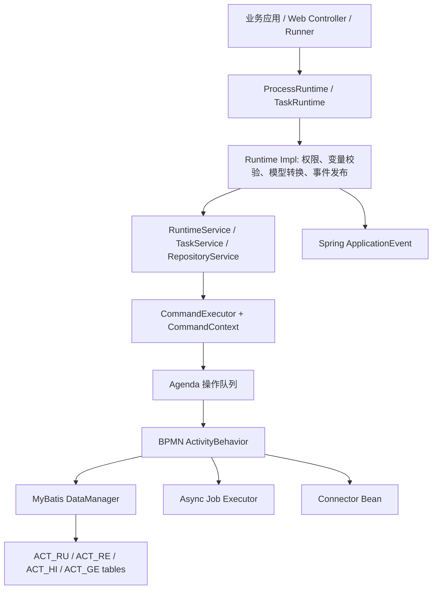

# Activiti 工作流平台项目深度分析文档

## 1. 项目背景

当前项目 `terminus-activiti` 是一个基于 Activiti 7 的轻量级工作流与 BPM 平台内核。它不是传统业务 CRUD 系统，而是面向企业流程数字化的基础能力，核心目标是把审批流、工单流、内容审核流、订单履约流等容易写死在业务代码中的状态流转抽象为 BPMN 2.0 流程模型。

面试开场可以这样说：

> 我参与分析和建设的是企业流程平台底座，重点不是某一个页面接口，而是流程定义部署、流程实例运行、人任务处理、服务任务扩展、变量映射、异步 Job、权限策略、MyBatis 持久化和 Spring Boot Starter 自动装配。它的业务价值是把流程从业务代码状态机里抽出来，让流程变更更多通过 BPMN 和扩展配置完成。

## 2. 业务价值

| 业务问题 | 平台能力 | 价值 |
| --- | --- | --- |
| 审批、工单、审核流程写死在业务代码里 | BPMN 流程建模和自动部署 | 降低流程变更成本 |
| 每个系统重复实现待办、领取、完成 | `TaskRuntime` 标准任务 API | 统一任务生命周期 |
| 服务任务和业务服务耦合 | Connector + `IntegrationContext` | 流程编排外部服务 |
| 流程变量随意传递，错误发现晚 | 扩展 JSON + 变量校验 | 提前暴露变量名和类型错误 |
| 异步节点失败后难恢复 | Async Job 锁、重试、过期恢复 | 提升可靠性 |
| 用户越权查看流程或任务 | Spring Security + Security Policies | 控制流程和任务可见性 |

## 3. 量化结果

以下数据来自对当前仓库的静态扫描：

| 指标 | 数量 | 说明 |
| --- | ---: | --- |
| 文件总数 | 4,874 | 多模块平台型工程 |
| Java 文件 | 2,836 | 覆盖 API、引擎、Starter、示例、测试 |
| 测试 Java 文件 | 801 | 单元测试、集成测试、conformance 测试较多 |
| Maven POM | 66 | 依赖和能力拆分清晰 |
| BPMN 资源 | 1,227 | 流程模型和引擎行为测试丰富 |
| 扩展 JSON | 59 | 流程变量、Connector 映射、模型扩展 |
| Spring factories | 20 | 大量 Spring Boot 自动装配入口 |
| 缓存 matcher | 30 | 覆盖任务、变量、执行树、Job、事件订阅等查询 |
| MyBatis 实体 XML | 27 | 持久化实体映射完整 |
| SQL 脚本 | 336 | 支持多数据库创建、删除、升级 |

这些是可以安全写进简历或面试里讲的量化结果。当前仓库没有线上压测报告，不建议虚构 TPS/QPS 提升。

## 4. 技术栈

| 技术 | 项目证据 | 用途 |
| --- | --- | --- |
| Java 11 | 根 `pom.xml` | 统一语言版本 |
| Spring Boot 2.6.2 | 根 `pom.xml`、starter、examples | 自动装配和示例应用 |
| Spring Security | runtime impl、安全模块、examples | 角色、用户、组、访问控制 |
| MyBatis 3.5.7 | `activiti-core/pom.xml`、mapping XML | 引擎持久化 |
| BPMN 2.0 | `*.bpmn20.xml` | 流程定义 |
| Jackson | connector、扩展模型 | JSON 解析 |
| H2/MySQL/Postgres/Oracle/MSSQL/DB2/HSQL | DB 脚本 | 多数据库兼容 |
| JUnit/Spring Boot Test | test 目录 | 行为和集成测试 |

未发现直接集成：Dubbo、Nacos、RocketMQ、Redis、Elasticsearch、Trantor。面试时应如实说明“当前仓库没有直接接入，可以通过 Connector、事件监听器和查询侧 read model 扩展”。

## 5. 模块划分

一级模块：

| 模块 | 定位 |
| --- | --- |
| `activiti-api` | 对外 API 和模型定义 |
| `activiti-core-common` | 安全、身份、连接器、资源发现、项目模型、表达式语言 |
| `activiti-core` | 核心引擎、BPMN 模型、转换、校验、Spring 集成、Starter |
| `activiti-dependencies` | 依赖聚合 |
| `activiti-dependency-check` | 依赖安全检查 |
| `activiti-examples` | 流程、人任务、Connector、Web、Spring Integration 示例 |

重点子模块：

| 子模块 | 职责 |
| --- | --- |
| `activiti-api-process-runtime` | 定义 `ProcessRuntime` |
| `activiti-api-task-runtime` | 定义 `TaskRuntime` |
| `activiti-api-process-runtime-impl` | 流程 runtime 实现、Connector 行为、变量映射 |
| `activiti-api-task-runtime-impl` | 任务 runtime 实现 |
| `activiti-engine` | Command、Agenda、BPMN 行为、Job、MyBatis、缓存 |
| `activiti-spring-boot-starter` | Spring Boot 自动装配 |
| `activiti-spring-process-extensions` | 扩展 JSON、变量类型、变量校验 |
| `activiti-spring-connector` | Connector 定义加载与校验 |
| `activiti-spring-security-policies` | 流程定义和流程实例安全策略 |

## 6. 整体架构



架构重点：

1. 业务侧使用 `ProcessRuntime`、`TaskRuntime`，不直接耦合底层引擎服务。
2. Runtime 实现统一处理权限、变量校验、模型转换、事件发布。
3. 引擎执行由 Command 和 Agenda 驱动，事务和缓存生命周期清晰。
4. 持久化层通过 MyBatis DataManager 操作 ACT 表。
5. 扩展层通过 Connector 和 Spring 事件对接业务服务。

## 7. 核心业务流程

### 7.1 流程启动

调用链：

```text
ProcessRuntimeImpl.start
  -> RuntimeService.createProcessInstanceBuilder
  -> ProcessInstanceBuilderImpl.start
  -> RuntimeServiceImpl.startProcessInstance
  -> commandExecutor.execute(new StartProcessInstanceCmd)
  -> StartProcessInstanceCmd.execute(CommandContext)
  -> ProcessInstanceHelper.createAndStartProcessInstance
  -> commandContext.getAgenda().planContinueProcessOperation
  -> CommandInvoker 消费 Agenda
  -> ContinueProcessOperation 执行 ActivityBehavior
```

面试讲法：

> 流程启动不是 API 层直接一路递归执行 BPMN，而是先进入 runtime 门面做权限和变量校验，再把底层动作封装成 Command。Command 在 CommandContext 里创建流程实例、执行实体和变量，然后把继续执行动作放进 Agenda，由 CommandInvoker 消费队列。这让事务、缓存、异常和异步边界都更清楚。

### 7.2 人任务处理

`TaskRuntime` 支持任务查询、创建、领取、释放、完成、删除、候选用户、候选组、分配和变量读取。

典型链路：

```text
TaskRuntimeImpl.complete
  -> 获取当前认证用户
  -> 校验任务可见
  -> 校验任务 assignee 是当前用户
  -> taskService.complete(taskId, variables)
  -> CommandExecutor
  -> 完成 UserTask 并推进后续 BPMN 节点
```

关键规则：

- `tasks()` 默认按当前用户和用户组过滤。
- `claim()` 要求任务可见且未分配。
- `complete()` 要求当前用户是 assignee。
- `assign()` 要求当前用户是 assignee，且新 assignee 是候选用户。

### 7.3 Connector 服务任务

调用链：

```text
BPMN serviceTask implementation="Movies.getMovieDesc"
  -> DefaultServiceTaskBehavior.execute
  -> applicationContext.getBean("Movies.getMovieDesc", Connector.class)
  -> IntegrationContextBuilder.from(execution)
  -> connector.apply(integrationContext)
  -> VariablesPropagator 写回 outbound variables
  -> leave(execution)
```

示例 `RankMovie`：

- BPMN 文件：`activiti-examples/activiti-api-basic-connector-example/src/main/resources/processes/RankMovie.bpmn20.xml`
- 扩展 JSON：`RankMovie-extensions.json`
- 代码示例：`DemoApplication.java`

流程：启动 `RankMovieId`，传入 `movieToRank`，serviceTask 调用 `Movies.getMovieDesc`，输出 `movieDescription`，扩展 JSON 映射为流程变量 `movieDesc`，网关判断后进入人工任务 `Add Rating`，用户完成任务时提交 `rating=5`。

### 7.4 Web 示例

`activiti-api-web-example` 中的 `DemoApplication` 暴露：

- `POST /documents`：接收文档内容并启动 `categorizeProcess`。
- `GET /process-definitions`：查询流程定义。

这个示例说明流程平台可以承载内容审核、分类和任务流转，不局限于审批。

## 8. Spring Boot 自动装配

关键文件：

- `activiti-core/activiti-spring-boot-starter/src/main/resources/META-INF/spring.factories`
- `activiti-core/activiti-api-impl/activiti-api-process-runtime-impl/src/main/resources/META-INF/spring.factories`
- `activiti-core/activiti-api-impl/activiti-api-task-runtime-impl/src/main/resources/META-INF/spring.factories`

主要自动装配类：

- `ProcessEngineAutoConfiguration`
- `ProcessRuntimeAutoConfiguration`
- `TaskRuntimeAutoConfiguration`
- `ConnectorsAutoConfiguration`
- `ConnectorAutoConfiguration`
- `ProcessExtensionsConfiguratorAutoConfiguration`

`ProcessEngineAutoConfiguration` 创建 `SpringProcessEngineConfiguration`，注入 `DataSource`、`PlatformTransactionManager`、`SpringAsyncExecutor`、`ActivitiProperties` 和资源发现组件，并配置部署资源、数据库 schema 更新、历史级别、强 UUID、自定义 MyBatis mapper、异步执行器参数等。

默认配置亮点：

- 默认启用异步执行器：`asyncExecutorActivate=true`。
- 默认部署名：`SpringAutoDeployment`。
- 默认 BPMN 扫描路径：`classpath*:**/processes/`。
- 默认后缀：`**.bpmn20.xml`、`**.bpmn`。
- 默认历史级别：`NONE`。
- 默认强 UUID：`useStrongUuids=true`。

## 9. MyBatis 与数据模型

MyBatis 映射路径：

`activiti-core/activiti-engine/src/main/resources/org/activiti/db/mapping/entity`

表族：

| 表族 | 含义 | 典型表 |
| --- | --- | --- |
| `ACT_RU_*` | 运行时 | `ACT_RU_EXECUTION`、`ACT_RU_TASK`、`ACT_RU_VARIABLE`、`ACT_RU_JOB` |
| `ACT_RE_*` | 仓库 | `ACT_RE_DEPLOYMENT`、`ACT_RE_PROCDEF`、`ACT_RE_MODEL` |
| `ACT_HI_*` | 历史 | `ACT_HI_PROCINST`、`ACT_HI_TASKINST`、`ACT_HI_VARINST` |
| `ACT_GE_*` | 通用 | `ACT_GE_PROPERTY`、`ACT_GE_BYTEARRAY` |
| `ACT_EVT_LOG` | 事件日志 | 引擎事件记录 |

仓库有 27 个 MyBatis 实体 XML 和 336 个 SQL 脚本，覆盖 H2、MySQL、Postgres、Oracle、MSSQL、DB2、HSQL 的 create、drop、upgrade，适合讲“平台级多数据库兼容”。

## 10. 缓存设计与性能优化

当前项目没有直接使用 Redis 做流程引擎缓存。核心缓存是命令级 `EntityCache`，生命周期在一次 `Command` 内。

关键类：

- `EntityCache`
- `EntityCacheImpl`
- `AbstractDataManager`
- `MybatisExecutionDataManager`
- `PerformanceSettings`
- `cachematcher` 包下 30 个 matcher

机制：

1. `EntityCacheImpl` 使用 `Map<Class<?>, Map<String, CachedEntity>>` 缓存实体。
2. `AbstractDataManager.findById` 先查缓存，没有再查 DB。
3. 列表查询先查 DB，再扫描缓存，把匹配条件的新实体或更新实体合并进结果。
4. 同 ID 时用缓存版本覆盖 DB 版本。
5. 当前命令中已标记删除的实体会从结果中过滤。
6. `MybatisExecutionDataManager` 支持 eager execution tree fetching，一次预取同 root process instance 的执行树。

面试重点：

> 这里的缓存不是跨请求共享缓存，而是命令上下文内的一致性缓存。流程推进中会频繁读写 execution、task、variable、job，很多状态还没 flush 到 DB。命令级缓存既减少重复查询，也保证同一事务内看到最新状态。

可优化点：

- `AbstractDataManager.getListFromCache` 中先 `cachedObjects.size()` 再判空，存在空指针风险，建议让缓存接口返回空集合或先判空。
- 对大规模流程定义/实例查询，关注是否真正下推分页。
- 复杂待办和流程搜索可通过事件同步到 Redis/ES read model，减少直接压运行时表。

## 11. 异步 Job 与可靠性

关键类：

- `AsyncExecutorProperties`
- `DefaultAsyncJobExecutor`
- `AcquireAsyncJobsDueRunnable`
- `ResetExpiredJobsRunnable`
- `ExecutorPerTenantAsyncExecutor`

默认参数：

| 参数 | 默认值 |
| --- | ---: |
| corePoolSize | 2 |
| maxPoolSize | 10 |
| queueSize | 100 |
| numberOfRetries | 3 |
| async job lock time | 5 分钟 |
| timer job lock time | 5 分钟 |
| acquire wait time | 10 秒 |
| reset expired jobs interval | 60 秒 |
| reset expired jobs page size | 3 |
| messageQueueMode | false |

执行机制：

1. `AcquireAsyncJobsDueRunnable` 周期性执行 `AcquireJobsCmd` 获取到期 Job。
2. 获取到 Job 后提交到异步执行器线程池。
3. 如果获取数量达到上限，立即继续获取，提高吞吐。
4. 如果队列满，等待配置时间，避免过载。
5. 集群多节点抢 Job 时的乐观锁异常被视为预期竞争。
6. `ResetExpiredJobsRunnable` 定期查找过期锁 Job 并重置。

## 12. Connector 与微服务实践

当前仓库没有直接接入 Dubbo/Nacos，但 Connector 是流程平台对接微服务的关键扩展点。

实现要点：

1. BPMN serviceTask 只声明 `implementation`。
2. Spring 容器中注册同名 `Connector` Bean。
3. `DefaultServiceTaskBehavior` 运行时获取 Bean 并调用 `Connector.apply`。
4. `IntegrationContextBuilder` 注入流程实例 ID、流程定义 key/version、businessKey、executionId、connectorType、appVersion、输入变量等上下文。
5. `VariablesPropagator` 将输出变量写回流程。

扩展方案：

- Connector 内部可调用 HTTP、Feign、Dubbo 或其他 RPC 服务。
- 事件监听器可桥接 RocketMQ/Kafka，把流程事件发给外部系统。
- 任务和流程变更事件可同步 Elasticsearch 做复杂搜索。
- Redis 可用于查询侧待办 read model 或用户组缓存，但不替代引擎命令级缓存。

## 13. 权限与安全

两层安全：

1. 方法级安全：`ProcessRuntimeImpl` 和 `TaskRuntimeImpl` 标注 `@PreAuthorize("hasRole('ACTIVITI_USER')")`。
2. 流程策略：`ProcessSecurityPoliciesManagerImpl` 根据用户、组、应用名、流程 key 判断 READ/WRITE 权限。

规则：

- 没有配置安全策略时默认允许。
- `ACTIVITI_ADMIN` 管理员访问全部。
- READ 权限包含 READ 和 WRITE，WRITE 权限只接受 WRITE。
- deny all 通过构造不存在的流程 key 返回空结果。
- 任务可见性基于 assignee、candidate user、candidate group。

## 14. 事件机制

事件用途：

- 流程启动、完成后做审计。
- 任务创建后推送待办。
- 变量变化后同步搜索索引。
- 流程异常后告警。
- 连接外部 MQ 或通知系统。

证据：

- `ProcessRuntimeImpl` 使用 `ApplicationEventPublisher`。
- `ProcessRuntimeAutoConfiguration` 注册 runtime event listener。
- 示例注册 `VariableEventListener<VariableCreatedEvent>` 和 `ProcessRuntimeEventListener<ProcessCompletedEvent>`。

## 15. 风险与优化方向

| 风险/问题 | 优化方向 |
| --- | --- |
| Connector Bean 名称运行时查找，配置错误会运行期失败 | 启动时扫描 BPMN serviceTask，校验 Connector Bean |
| 历史级别默认 `NONE`，生产审计不足 | 按合规启用 AUDIT/FULL，并归档历史表 |
| 大规模任务/流程查询可能压运行时表 | 增加索引、分页优化、构建 read model |
| 异步 Job 默认批量较小 | 根据压测调整 acquisition batch、线程池、队列 |
| 未接 MQ/ES/Redis | 用事件监听器桥接 MQ/ES，Redis 放查询侧缓存 |
| `getListFromCache` 空集合处理不够稳 | 返回空集合或先判空 |

## 16. 面试成果总结

可以这样总结：

> 这个项目的业务成果是把流程建模、流程运行、人任务、服务任务、变量、安全和异步执行沉淀为平台能力，帮助业务系统减少硬编码流程状态机。技术上，我重点掌握了 Runtime API 门面、Command + Agenda 执行模型、MyBatis 持久化、命令级缓存、执行树预取、Connector 扩展、异步 Job 和安全策略。量化上，项目包含 2,836 个 Java 文件、801 个测试类、1,227 个 BPMN 资源、30 个缓存 matcher 和 336 个 SQL 脚本。

## 17. 证据索引

| 主题 | 源项目相对路径 |
| --- | --- |
| 根 POM | `pom.xml` |
| 模块 POM | `activiti-api/pom.xml`、`activiti-core/pom.xml`、`activiti-core-common/pom.xml` |
| Starter spring.factories | `activiti-core/activiti-spring-boot-starter/src/main/resources/META-INF/spring.factories` |
| 引擎自动装配 | `activiti-core/activiti-spring-boot-starter/src/main/java/org/activiti/spring/boot/ProcessEngineAutoConfiguration.java` |
| 配置项 | `ActivitiProperties.java`、`AsyncExecutorProperties.java` |
| 流程 API | `activiti-api/activiti-api-process-runtime/.../ProcessRuntime.java` |
| 任务 API | `activiti-api/activiti-api-task-runtime/.../TaskRuntime.java` |
| 流程实现 | `ProcessRuntimeImpl.java` |
| 任务实现 | `TaskRuntimeImpl.java` |
| 命令链路 | `RuntimeServiceImpl.java`、`StartProcessInstanceCmd.java`、`ProcessInstanceHelper.java` |
| Agenda | `CommandInvoker.java`、`DefaultActivitiEngineAgenda.java`、`ContinueProcessOperation.java` |
| 缓存 | `EntityCacheImpl.java`、`AbstractDataManager.java` |
| 执行树预取 | `MybatisExecutionDataManager.java` |
| MyBatis XML | `activiti-core/activiti-engine/src/main/resources/org/activiti/db/mapping/entity` |
| DB 脚本 | `activiti-core/activiti-engine/src/main/resources/org/activiti/db` |
| Connector | `ConnectorDefinitionService.java`、`DefaultServiceTaskBehavior.java`、`IntegrationContextBuilder.java` |
| 变量映射 | `ExtensionsVariablesMappingProvider.java`、`ProcessVariablesPayloadValidator.java` |
| 安全策略 | `ProcessSecurityPoliciesManagerImpl.java` |
| 异步执行器 | `DefaultAsyncJobExecutor.java`、`AcquireAsyncJobsDueRunnable.java`、`ResetExpiredJobsRunnable.java` |
| 示例 | `activiti-examples/activiti-api-basic-connector-example`、`activiti-examples/activiti-api-web-example` |
