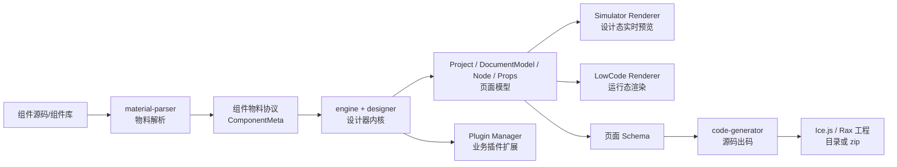
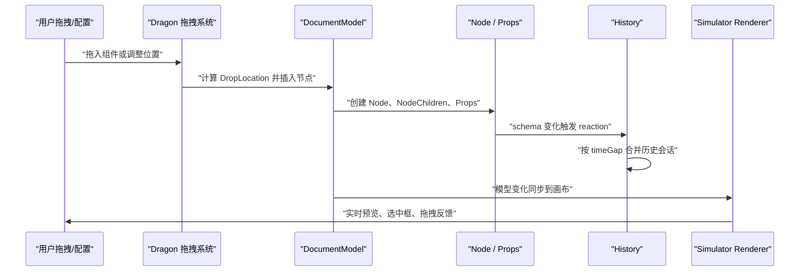
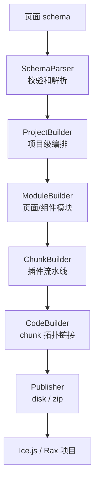

# Terminus LowCode Engine 项目深度分析文档

生成时间：2026-06-17  
源码目录：`D:\java\lianqian\code\my\terminus-lowcode-engine`

## 1. 项目背景

`terminus-lowcode-engine` 是一套面向企业级中后台场景的低代码引擎底座。它的核心目标不是做一个单独的页面，而是提供一套可复用的低代码研发基础设施：业务人员或平台开发者通过可视化设计器编排页面，系统用统一 schema 描述页面结构、组件属性、数据源、生命周期、国际化和工程依赖，再通过运行时渲染器或出码工具链把 schema 转换为真实页面或源码工程。

从代码结构看，项目采用 TypeScript + Lerna + Yarn Workspaces 的 monorepo 方式组织，核心能力被拆成设计器、编辑器内核、插件体系、shell 门面、React/Rax 渲染器、设计态模拟器、物料解析和代码生成等模块。这个设计非常适合作为面试项目，因为它不是简单 CRUD，而是一个有协议、有内核、有扩展、有性能优化、有工程化闭环的平台型项目。

业务价值可以概括为三句话：

1. 降低中后台页面交付成本：把大量表单、表格、详情、配置页从手写代码变成 schema 编排和物料复用。
2. 提升平台复用能力：通过微内核、插件、物料协议和出码方案，让不同业务低代码平台复用同一套设计器底座。
3. 打通研发闭环：覆盖“物料入料 -> 页面搭建 -> 实时预览 -> schema 保存 -> 源码出码 -> 工程发布”的完整链路。

## 2. 项目量化画像

以下指标来自本地仓库静态扫描，属于可在面试中放心使用的量化结果。

| 指标 | 数值 | 说明 |
| --- | ---: | --- |
| 核心 packages | 15 个 | 位于 `packages`，覆盖设计器、引擎、shell、渲染器、模拟器、插件、types、utils |
| 独立工具 modules | 2 个 | 位于 `modules`，分别是 `code-generator` 和 `material-parser` |
| TS/JS/TSX/JSX 源码文件 | 1034 个 | 排除构建产物后统计 |
| 测试文件 | 72 个 | 覆盖 designer、code-generator、material-parser 等关键模块 |
| 出码插件源码 | 74 个 | 位于 `modules/code-generator/src/plugins` |
| 出码测试样例目录 | 265 个 | 位于 `modules/code-generator/test-cases` |
| 支持渲染体系 | 2 套 | React 和 Rax |
| 支持出码方案 | 2 套内置 | Ice.js 和 Rax，可通过 solution/plugin 扩展 |
| 出码运行形态 | 4 类 | CLI、Node 调用、浏览器 Web Worker、设计器插件集成 |
| Node 版本约束 | `>=14.17.0 <16` | 来自根 `package.json` |
| 包管理与发布 | Lerna 4 + Yarn Workspaces | 来自根 `package.json` 与 `lerna.json` |

面试时建议这样表达量化结果：

> 这个项目不是一个单模块页面应用，而是一个 15 个核心包加 2 个工具模块的低代码引擎 monorepo。仓库里有 1000 多个 TS/JS 相关源码文件、70 多个测试文件、70 多个出码插件源码和 260 多个出码测试样例目录。它支持 React/Rax 两套渲染体系，以及 Ice.js/Rax 两套内置出码方案。

## 3. 技术栈识别

### 3.1 当前仓库实际使用的技术

| 分类 | 技术 |
| --- | --- |
| 语言 | TypeScript、JavaScript、TSX、JSX |
| 前端框架 | React、Rax |
| 状态管理 | MobX observable、computed、reaction、autorun |
| 工程管理 | Lerna 4、Yarn Workspaces、npm scripts |
| 渲染协议 | 低代码 schema、组件物料 schema、JSSlot、JSExpression、JSFunction |
| 插件机制 | 插件注册、初始化、销毁、依赖排序、版本校验、偏好配置 |
| 出码能力 | SchemaParser、ProjectBuilder、ModuleBuilder、ChunkBuilder、CodeBuilder、publisher |
| 物料解析 | TypeScript/JavaScript AST 解析、动态 sandbox 解析、AJV 校验 |
| 浏览器性能 | Web Worker、requestIdleCallback、AssetLoader、CDN/UMD externals |
| 网络请求 | fetch、jsonp 数据源请求 |
| 测试 | Jest 相关测试与快照测试 |

### 3.2 当前仓库没有使用的技术

用户要求中提到 Spring Boot、Dubbo、Nacos、RocketMQ、Redis、MySQL、Elasticsearch、MyBatis、Trantor 等技术，但本仓库没有发现对应代码或配置。准确说，这个项目是低代码引擎前端/工具链仓库，不是 Java 微服务后端仓库。

面试时不能说“本项目用了 Redis/RocketMQ/MySQL”。更稳的讲法是：

> 当前仓库主要负责低代码引擎、设计态、渲染态和出码工具链。如果业务落地需要服务端，可以把 schema 存储、物料中心、出码任务、发布流水线拆成后端服务：MySQL 存 schema 和物料元数据，Redis 缓存高频物料和页面草稿，MQ 异步处理批量出码和物料解析，ES 支撑物料搜索，Nacos/Dubbo 或 HTTP 网关负责服务治理。这些属于落地架构扩展，不是当前仓库内已经实现的代码。

## 4. 整体架构

项目可以按“协议中心 + 微内核设计器 + 渲染/出码双出口”理解。



核心思想：

1. 物料解析模块把业务组件转成标准组件描述，供设计器识别。
2. 设计器不直接操作 DOM，而是维护 Project、DocumentModel、Node、Props 等模型。
3. 模拟器将模型转换为真实 React/Rax 组件实例，并反向支持选中、拖拽、定位。
4. 运行态渲染器消费 schema，支持条件、循环、插槽、表达式、数据源和生命周期。
5. 出码模块消费 schema，生成可运行、可维护的源码工程。
6. 插件体系把业务差异放到扩展点中，避免污染内核。

## 5. 模块说明

### 5.1 `packages/engine`

定位：低代码引擎入口。

关键文件：`packages/engine/src/engine-core.ts`

核心职责：

- 初始化 `Editor`、`Skeleton`、`Designer`、插件管理器等核心对象。
- 对外暴露 `Project`、`Material`、`Setters`、`Event`、`Hotkey` 等 shell API。
- 注册内置插件和设计器视图。
- 连接编辑器内核、设计器、骨架、插件生态。

面试表达：

> `engine` 更像启动器和总装配层，它不承载具体业务页面逻辑，而是把编辑器上下文、设计器、插件管理、shell API 组装起来，给上层低代码平台提供统一入口。

### 5.2 `packages/editor-core`

定位：编辑器底层上下文和基础能力。

关键文件：

- `packages/editor-core/src/editor.ts`
- `packages/editor-core/src/config.ts`
- `packages/editor-core/src/di/setter.ts`

核心职责：

- 管理全局上下文 `context Map`。
- 提供配置中心 `EngineConfig`。
- 管理 setter 注册。
- 提供事件、请求、资产加载等底层能力。

技术点：

- 使用 `Map` 做上下文索引。
- 使用 `Promise.all` 并行加载资产。
- `engineConfig` 包含 `disableAutoRender`、`disableDetecting` 等性能开关。

### 5.3 `packages/designer`

定位：低代码设计器核心，是项目最重要的业务模块。

关键文件：

- `packages/designer/src/project/project.ts`
- `packages/designer/src/document/document-model.ts`
- `packages/designer/src/document/node/node.ts`
- `packages/designer/src/document/node/node-children.ts`
- `packages/designer/src/document/node/props/prop.ts`
- `packages/designer/src/document/node/props/props.ts`
- `packages/designer/src/document/history.ts`
- `packages/designer/src/document/selection.ts`
- `packages/designer/src/designer/designer.ts`
- `packages/designer/src/designer/dragon.ts`
- `packages/designer/src/designer/location.ts`
- `packages/designer/src/designer/offset-observer.ts`
- `packages/designer/src/plugin/plugin-manager.ts`

核心职责：

- 将 schema 转换为设计态模型。
- 管理文档、节点、属性、子节点、选区、历史、拖拽、定位。
- 维护组件元数据缓存。
- 管理插件生命周期和插件依赖。
- 连接模拟器，完成设计态交互。

这是面试最应该重点讲的模块。

### 5.4 `packages/shell`

定位：对外 API 门面和防腐层。

关键文件：

- `packages/shell/src/project.ts`
- `packages/shell/src/document-model.ts`
- `packages/shell/src/node.ts`
- `packages/shell/src/history.ts`
- `packages/shell/src/dragon.ts`

核心职责：

- 将内部复杂模型包装成稳定、可控的 API。
- 隔离内部 symbol、私有属性和实现细节。
- 给插件和业务平台提供统一访问方式。

设计价值：

> shell 是典型 Facade/Anti-Corruption Layer。插件只依赖稳定 API，不直接耦合 designer 内部类，这样内核重构时不会大面积影响业务插件。

### 5.5 `packages/editor-skeleton`

定位：编辑器工作台布局骨架。

关键文件：`packages/editor-skeleton/src/skeleton.ts`

核心职责：

- 管理顶部、左侧、右侧、底部、主区域等容器。
- 承载插件面板、工具栏、设置器面板、大纲树等 UI。
- 用 `panels Map`、`containers Map` 管理布局对象。

### 5.6 `packages/renderer-core`

定位：schema 运行时渲染核心。

关键文件：

- `packages/renderer-core/src/renderer/base.tsx`
- `packages/renderer-core/src/renderer/renderer.tsx`
- `packages/renderer-core/src/renderer/page.tsx`
- `packages/renderer-core/src/renderer/block.tsx`
- `packages/renderer-core/src/renderer/component.tsx`
- `packages/renderer-core/src/utils/data-helper.ts`
- `packages/renderer-core/src/utils/request.ts`

核心职责：

- 将 schema 渲染成真实组件树。
- 支持条件渲染、循环渲染、插槽、表达式、生命周期、自定义方法。
- 支持数据源初始化和 fetch/jsonp 请求。
- 支持渲染失败兜底组件。

### 5.7 React/Rax Renderer 与 Simulator Renderer

定位：运行态渲染器和设计态模拟器渲染器。

关键文件：

- `packages/react-renderer`
- `packages/rax-renderer`
- `packages/react-simulator-renderer/src/renderer.ts`
- `packages/react-simulator-renderer/src/renderer-view.tsx`
- `packages/rax-simulator-renderer/src/renderer.ts`

核心职责：

- React/Rax renderer 负责正式运行态渲染。
- simulator renderer 负责设计态 iframe/画布渲染，并维护节点与组件实例的双向映射。
- 通过 `instancesMap`、`documentInstanceMap` 缓存实例和文档实例。
- 通过 `AssetLoader` 加载外部组件库资源。
- 通过 memory history 模拟多页面路由。

### 5.8 `modules/code-generator`

定位：schema 到源码工程的代码生成工具链。

关键文件：

- `modules/code-generator/src/parser/SchemaParser.ts`
- `modules/code-generator/src/generator/ProjectBuilder.ts`
- `modules/code-generator/src/generator/ModuleBuilder.ts`
- `modules/code-generator/src/generator/ChunkBuilder.ts`
- `modules/code-generator/src/generator/CodeBuilder.ts`
- `modules/code-generator/src/solutions/icejs.ts`
- `modules/code-generator/src/solutions/rax-app.ts`
- `modules/code-generator/src/standalone-loader.ts`
- `modules/code-generator/src/standalone-worker.ts`
- `modules/code-generator/src/publisher/disk/index.ts`
- `modules/code-generator/src/publisher/zip/index.ts`

核心职责：

- 校验和解析 schema。
- 生成页面、组件、路由、入口、样式、依赖、配置等工程文件。
- 通过插件 pipeline 生成不同类型代码片段。
- 支持输出磁盘目录或 zip。
- 支持浏览器 Web Worker 出码。

### 5.9 `modules/material-parser`

定位：组件物料入料模块。

关键文件：

- `modules/material-parser/src/index.ts`
- `modules/material-parser/src/scan.ts`
- `modules/material-parser/src/parse/index.ts`
- `modules/material-parser/src/parse/js/index.ts`
- `modules/material-parser/src/parse/js/resolver/index.ts`
- `modules/material-parser/src/parse/js/resolver/resolveImport.ts`
- `modules/material-parser/src/parse/ts/index.ts`
- `modules/material-parser/src/parse/dynamic/index.ts`
- `modules/material-parser/src/parse/dynamic/requireInSandbox.ts`
- `modules/material-parser/src/generate.ts`
- `modules/material-parser/src/validate/index.ts`

核心职责：

- 扫描组件包。
- 解析 TS/JS 组件声明、propTypes、defaultProps、类型定义。
- 动态 sandbox 加载组件元信息。
- 生成符合物料协议的 ComponentMeta。
- 使用 AJV 做协议校验。

## 6. 核心业务流程

### 6.1 引擎启动链路

典型链路：

1. 业务平台引入 `@alilc/lowcode-engine`。
2. `engine-core.ts` 初始化编辑器上下文。
3. 创建 `Designer`、`Skeleton`、plugin manager。
4. 注册内置插件，例如设计器插件、大纲树插件、setter、面板等。
5. 暴露 `Project`、`Material`、`Setters`、`Event`、`Hotkey` 等 shell API。
6. 插件通过 shell API 操作项目、文档、节点、物料和编辑器布局。

价值：

- 平台接入复杂度低，上层只需要围绕 engine API 做定制。
- 内核与业务插件解耦，能支撑多平台复用。

### 6.2 页面搭建链路

典型链路：



关键代码证据：

- `packages/designer/src/designer/dragon.ts`：负责拖拽、传感器、定位事件。
- `packages/designer/src/designer/location.ts`：描述投放位置。
- `packages/designer/src/document/document-model.ts`：维护文档模型和节点索引。
- `packages/designer/src/document/node/node.ts`：维护节点属性、子节点、插槽、条件、循环等。
- `packages/designer/src/document/history.ts`：用 MobX reaction 监听 schema 变化，提供 undo/redo。

### 6.3 schema 模型链路

设计态核心模型是：

```text
Project
  -> DocumentModel
    -> Node
      -> Props / Prop
      -> NodeChildren
      -> Slot / Condition / Loop / State
```

职责拆分：

- `Project`：管理整个项目的多个文档、项目 schema、i18n、配置和模拟器 ready 事件。
- `DocumentModel`：管理单个页面或文档，维护 `_nodesMap`，提供节点查找、插入、删除、导入导出。
- `Node`：表示低代码组件节点，包含 `componentName`、`props`、`children`、`condition`、`loop`、`locked`、`hidden` 等能力。
- `Props/Prop`：表示属性模型，支持字面量、对象、数组、表达式、插槽等复杂值。
- `NodeChildren`：管理子节点集合，支持插入、删除、排序。

面试重点：

> 这个模型分层很关键。schema 是最终协议，但设计态不能直接操作 JSON；否则拖拽、撤销、选中、属性面板、模拟器同步都会非常复杂。因此项目把 schema 转换成响应式模型，并用 Map 做节点索引，用 History 管理变更。

### 6.4 设计态模拟器链路

典型链路：

1. `BuiltinSimulatorHost` 创建和管理 iframe/模拟器上下文。
2. 注入环境变量、组件库资源、主题、runtime、上下文工具。
3. 等待 assets、components、context ready。
4. `react-simulator-renderer` 或 `rax-simulator-renderer` 接收 project/document schema。
5. 使用 `AssetLoader` 加载组件库。
6. `buildComponents` 生成组件映射。
7. 用 `LowCodeRenderer` 渲染真实组件树。
8. 用 `instancesMap` 建立低代码节点 id 到真实组件实例的映射。
9. 设计器通过 host 找到实例，完成选中、悬停、拖拽和定位。

关键代码证据：

- `packages/designer/src/builtin-simulator/host.ts`
- `packages/react-simulator-renderer/src/renderer.ts`
- `packages/react-simulator-renderer/src/renderer-view.tsx`
- `packages/utils/src/asset.ts`
- `packages/utils/src/build-components.ts`

### 6.5 运行态渲染链路

运行态渲染链路：

```text
低代码 schema
  -> renderer-core base/page/block/component
  -> 解析 condition / loop / props / JSSlot / JSExpression
  -> 加载数据源
  -> 调用生命周期和自定义方法
  -> 渲染 React/Rax 组件树
```

关键能力：

- 条件渲染：根据 schema 中的 condition 控制节点是否渲染。
- 循环渲染：根据 loop/list 数据批量渲染节点。
- 插槽渲染：把 JSSlot 转成子组件或渲染函数。
- 表达式执行：把 JSExpression、JSFunction 转成运行态行为。
- 数据源：通过 `DataHelper` 支持 fetch/jsonp、初始化请求、状态维护、请求前后处理。
- 异常兜底：渲染异常时使用 fallback 组件，提升页面可靠性。

关键代码证据：

- `packages/renderer-core/src/renderer/component.tsx`
- `packages/renderer-core/src/utils/data-helper.ts`
- `packages/renderer-core/src/utils/request.ts`

### 6.6 物料入料链路

典型链路：

```text
组件包/源码路径
  -> scan 扫描包信息
  -> parse 解析 JS/TS/dynamic 元数据
  -> resolver 解析 import、propTypes、defaultProps、子组件
  -> generate 生成 ComponentMeta
  -> validate 使用 AJV 校验协议
  -> 设计器物料面板消费
```

业务价值：

- 已有组件库可以低成本进入低代码平台。
- 组件属性、默认值、描述、子组件信息可以自动提取。
- 降低人工维护物料 JSON 的成本。

### 6.7 出码链路

典型链路：



关键点：

- `SchemaParser` 提取 containers、dependencies、router、utils、packages 等信息。
- `ProjectBuilder` 负责项目级模块生成，并用 `Promise.all` 并行生成页面/组件模块。
- `ChunkBuilder` 运行 74 个左右的出码插件源码，把 schema 转成代码片段。
- `CodeBuilder` 按依赖关系链接 chunk，生成最终文件。
- `publisher` 支持输出到磁盘或 zip。
- `standalone-loader` 和 `standalone-worker` 支持浏览器 Worker 出码。

业务价值：

- 解决低代码常见痛点：只能在线运行，难以二次开发。
- 可以把 schema 产物转成标准前端工程，接入 Git、CI/CD 和代码评审流程。
- 支持多套 solution，使不同业务技术栈能复用同一协议。

## 7. 架构与关键设计

### 7.1 微内核 + 插件体系

关键代码：`packages/designer/src/plugin/plugin-manager.ts`

插件体系负责：

- 插件注册。
- 插件初始化。
- 插件禁用和删除。
- 插件销毁。
- 插件偏好配置。
- 插件依赖排序。
- 引擎版本检查。

`sequencify.ts` 用于处理插件之间的依赖顺序。这样能避免插件初始化顺序随机导致的问题，例如大纲树依赖设计器、业务面板依赖物料和项目 API。

面试可讲：

> 我把它理解为前端低代码领域的微内核架构。内核只提供稳定协议、生命周期、事件和基础模型，业务差异通过插件扩展。这样做可以让平台能力按需组合，也方便不同业务线复用同一套底座。

### 7.2 shell API 门面

关键代码：`packages/shell/src`

内部 `designer` 模型比较复杂，直接暴露给插件会造成强耦合。`shell` 包对 Project、DocumentModel、Node、History、Dragon 等对象做一层包装，形成稳定 API。

收益：

- 降低插件使用门槛。
- 避免插件访问内部私有状态。
- 内核重构时保持 API 兼容。
- 形成清晰的边界层。

这是典型 Facade 模式，也可以称为防腐层。

### 7.3 schema 协议驱动

低代码系统最重要的抽象不是 UI，而是协议。该项目用 schema 贯穿设计态、运行态、出码和物料体系：

- 设计器产出页面 schema。
- 模拟器消费 schema 做实时预览。
- 运行态 renderer 消费 schema 渲染页面。
- code-generator 消费 schema 生成工程。
- material-parser 产出组件物料 schema。

协议化带来的价值：

- 模块解耦。
- 产物可迁移。
- 技术栈可替换。
- 业务平台可复用。
- 出码、渲染、搭建可以独立演进。

### 7.4 响应式文档模型

设计器大量使用 MobX，让 Project、DocumentModel、Node、Props、Selection、History 等状态具备响应式能力。

典型场景：

- 属性面板修改 prop 后，Node/Props 模型变化。
- 模型变化触发 History reaction。
- 模拟器 autorun 观察 project/document 变化并更新画布。
- componentMetasMap 更新后触发模拟器重新 buildComponents。

这种模式比手工事件广播更适合复杂编辑器，因为依赖关系更细，更新粒度更小。

### 7.5 设计态与运行态分离

设计态关注可编辑性：

- 节点选中。
- 拖拽定位。
- 大纲树。
- 属性面板。
- 撤销重做。
- 画布检测。
- 节点实例反查。

运行态关注真实渲染：

- 条件、循环、插槽。
- 数据源。
- 生命周期。
- 表达式。
- 路由。
- 组件容错。

这种分离让渲染器可以更轻，设计态模拟器可以更强。

### 7.6 出码插件流水线

`code-generator` 没有把所有生成逻辑写成一坨字符串拼接，而是通过 parser、builder、chunk、plugin、publisher 分层处理。

优势：

- 不同 framework solution 可以复用基础流程。
- 单个生成逻辑可以插件化替换。
- chunk 之间可以声明依赖并排序。
- 便于测试快照覆盖生成结果。

### 7.7 物料解析与协议校验

`material-parser` 同时支持静态解析和动态解析。动态解析通过 `vm2` sandbox 执行组件包以获取元信息，最后用 AJV 校验物料协议。

价值：

- 静态解析适合 TS/JS 源码。
- 动态解析适合部分运行时导出的组件元数据。
- AJV 校验避免无效物料进入设计器，提升平台稳定性。

## 8. 性能优化

### 8.1 多层 Map 索引减少递归扫描

项目有大量 Map 缓存：

- `Editor.context Map`：全局上下文。
- `PluginManager.pluginsMap`：插件索引。
- `Project.documentsMap`：文档索引。
- `DocumentModel._nodesMap`：节点索引。
- `Designer._componentMetasMap` 和 `_lostComponentMetasMap`：组件元数据索引。
- `Props/Prop maps`：属性索引。
- `Simulator.instancesMap`：节点 id 到组件实例索引。
- `documentInstanceMap`：文档实例索引。
- `Outline treeMap/treeNodesMap`：大纲树索引。
- `material-parser` AST/import cache：解析缓存。
- `standalone-loader.workerJsCache`：Worker 脚本缓存。

业务场景中，低代码页面节点数量可能很多。如果每次选中、拖拽、属性更新都递归扫描 schema 树，复杂页面会明显卡顿。Map 索引把高频查找从树遍历降为近似 O(1)，这是设计器性能的基础。

### 8.2 Web Worker 出码避免阻塞主线程

关键文件：

- `modules/code-generator/src/standalone-loader.ts`
- `modules/code-generator/src/standalone-worker.ts`

浏览器出码时，schema 解析、项目构建、代码生成属于重计算任务。如果放在主线程，会影响设计器拖拽和编辑体验。项目通过 Web Worker 把出码任务放到后台线程执行，并提供超时和 terminate 机制。

性能价值：

- 在线出码时不阻塞 UI。
- 大 schema 生成失败或超时时可回收资源。
- 同一个 Worker 脚本 URL 可以复用缓存。

### 8.3 并行模块生成

关键文件：`modules/code-generator/src/generator/ProjectBuilder.ts`

`ProjectBuilder` 在生成多个页面/组件模块时使用 `Promise.all`。页面模块之间天然独立，可以并行生成，适合多页面低代码应用。

可面试表达：

> 出码链路里我会把项目级生成和模块级生成拆开，页面/组件模块没有强依赖时并行处理，最后再汇总 chunk 和工程文件。这样复杂项目的出码耗时不会随着页面数完全线性增长。

### 8.4 requestIdleCallback 优化画布定位计算

关键文件：`packages/designer/src/designer/offset-observer.ts`

设计器需要频繁计算 DOM rect，用于选中框、悬停框、拖拽辅助线等。`OffsetObserver` 使用 `requestIdleCallback` 在浏览器空闲时间计算 offset，减少滚动和拖拽过程中的主线程抢占。

### 8.5 AssetLoader 和 CDN/UMD 外置

关键文件：

- `packages/utils/src/asset.ts`
- `packages/react-simulator-renderer/src/renderer.ts`

低代码平台通常需要加载大量组件库和样式资源。项目通过 AssetLoader 加载资源，并支持 UMD/CDN 方式接入引擎和物料资源。

收益：

- 组件库可以按资源清单动态加载。
- 多个平台可以共享 CDN 缓存。
- 降低业务应用 bundle 体积。
- 便于灰度升级引擎和组件库版本。

### 8.6 响应式更新降低全量刷新

MobX 的 computed、reaction、autorun 用于精细化追踪依赖。相比每次 schema 变动都全量刷新整个设计器，响应式模型可以只更新相关区域。

典型例子：

- `History` reaction 监听导出的 schema。
- simulator renderer autorun 观察 document 和 componentsMap。
- componentMetasMap 变化触发 buildComponents。
- selection 变化只影响选中态 UI。

### 8.7 可关闭的设计态检测

`engineConfig` 中存在 `disableAutoRender`、`disableDetecting` 等配置。对于超大页面或特定嵌入场景，可以关闭自动渲染或检测能力，降低画布开销。

## 9. 缓存设计

### 9.1 缓存不是 Redis，而是编辑器内存态缓存

本仓库没有 Redis。这里的缓存主要是前端编辑器和工具链内部的多层内存缓存，目标是解决低代码编辑器高频读写、高频定位、高频解析的问题。

### 9.2 文档和节点缓存

`DocumentModel` 维护 `_nodesMap`，支持按节点 id 快速获取 Node。节点增删时同步更新 Map，避免每次从根节点递归查找。

适用场景：

- 属性面板定位当前节点。
- 拖拽时判断目标节点。
- 删除节点时清理子树。
- 导出 schema 时去重和索引。
- 大纲树和选区同步。

### 9.3 组件元数据缓存

`Designer` 维护 `_componentMetasMap` 和 `_lostComponentMetasMap`。物料加载后，组件名到 meta 的查找非常频繁，缓存可以减少重复解析。

`lostComponentMetasMap` 还能处理 schema 中存在但当前物料包缺失的组件，避免页面直接崩溃。

### 9.4 渲染实例缓存

`react-simulator-renderer` 和 `rax-simulator-renderer` 维护 `instancesMap`，把低代码节点 id 映射到真实组件实例数组。

价值：

- 节点选中时能快速找到 DOM/组件实例。
- 真实组件实例变化时可以增量更新。
- 一个低代码节点对应多个实例时仍可表达。
- 节点卸载时可以清理无效引用。

### 9.5 出码 Worker 缓存

`standalone-loader` 中的 `workerJsCache` 以 Worker 脚本 URL 为 key，缓存脚本内容和 Blob URL。多次出码时不需要重复 fetch worker 脚本。

### 9.6 物料解析缓存

`material-parser` 中存在：

- JS resolver 作用域级 cache。
- `resolveImport.ts` 路径级 AST cache。
- definition 解析 cache。

物料解析常常会重复遇到同一 import、同一类型定义、同一子组件，缓存能减少重复 AST 解析和递归解析成本。

## 10. 微服务实践与服务化落地

### 10.1 当前仓库的真实情况

当前仓库不是后端微服务项目，不包含 Spring Boot、Dubbo、Nacos、RocketMQ、Redis、MySQL、ES、MyBatis 代码。它的“微服务实践”更准确地说是：

- 前端微内核。
- npm 能力包拆分。
- schema 协议边界。
- 可独立部署的出码服务能力。
- 可独立部署的物料解析服务能力。

### 10.2 code-generator 可服务化

`modules/code-generator` 可以作为 Node 服务或 Java 后端调用的外部出码服务：


如果落地到 Java 微服务架构，可以这样设计：

- Spring Boot 提供出码任务 API。
- MySQL 存任务、schema 版本、生成记录。
- Redis 缓存常用 solution、物料 manifest、临时出码结果。
- RocketMQ 异步处理批量出码任务。
- Nacos 做服务注册和配置中心。
- 生成任务实际调用 Node worker 或容器化 code-generator。
- 最终产物上传对象存储或 Git 仓库。

面试中要强调：这是“基于本仓库能力的服务化落地方案”，不是仓库已有实现。

### 10.3 material-parser 可服务化

`modules/material-parser` 可以独立成为物料入料服务：

```text
npm 包 / Git 地址 / 本地组件库
  -> 物料解析任务
  -> scan + parse + generate + validate
  -> ComponentMeta manifest
  -> 物料中心存储
  -> 设计器加载物料
```

服务化后可以接入：

- MQ：异步解析大量组件库。
- Redis：缓存解析结果和 manifest。
- MySQL：存物料版本、组件元数据、解析状态。
- ES：支撑组件搜索和属性检索。
- 权限系统：控制组件库可见范围。

### 10.4 schema 是服务边界

这个项目最像微服务契约的部分是协议：

- 页面 schema 是设计器与渲染器/出码服务之间的契约。
- 组件物料 schema 是物料服务与设计器之间的契约。
- 生成结果结构是出码服务与发布系统之间的契约。

只要协议稳定，各服务可以独立部署、独立扩容、独立替换技术栈。

## 11. 可靠性与质量保障

### 11.1 插件可靠性

插件管理器做了以下保护：

- 插件名校验。
- 重复注册处理。
- 引擎版本匹配。
- 依赖排序。
- 插件禁用。
- destroy 生命周期。

这能降低业务插件对引擎稳定性的影响。

### 11.2 渲染可靠性

renderer-core 支持 fallback component，渲染异常时不至于整页白屏。对于低代码平台尤其重要，因为 schema、物料和表达式可能来自不同团队，错误输入不可完全避免。

### 11.3 出码可靠性

code-generator 提供：

- schema parse 阶段校验。
- builder 分层。
- publisher 输出错误处理。
- standalone worker 超时和 terminate。
- 大量 test-cases 快照校验生成结果。

### 11.4 物料可靠性

material-parser 使用 AJV 校验生成的物料协议，避免非法组件描述进入设计器。

### 11.5 测试覆盖

仓库扫描到 72 个测试文件，覆盖：

- 设计器节点增删改、拖拽、视口、模拟器、设置器。
- code-generator 多场景生成样例。
- material-parser 物料解析快照。

## 12. 难点与亮点

### 12.1 难点一：schema 与设计态模型的双向转换

低代码页面最终保存的是 JSON schema，但编辑器内部需要支持拖拽、选中、属性配置、撤销重做、插槽、条件、循环等复杂交互。项目通过 Project、DocumentModel、Node、Props 分层把静态 schema 转成可响应的设计态模型，再在保存、预览、出码时导出 schema。

### 12.2 难点二：设计态模拟器不是普通预览

模拟器要同时满足真实渲染和编辑交互：

- 既要渲染真实业务组件。
- 又要支持节点选中、定位、拖拽。
- 还要处理 iframe 通信、资源加载、组件实例映射。

这就是 `BuiltinSimulatorHost` 和 simulator renderer 复杂的原因。

### 12.3 难点三：插件体系需要兼顾扩展性和稳定性

插件过度自由会破坏内核稳定性；限制太多又无法满足业务平台差异。项目通过 shell API、版本校验、依赖排序、生命周期管理来控制边界。

### 12.4 难点四：出码既要通用又要可定制

不同团队可能使用不同工程框架、路由方案、样式方案和目录规范。code-generator 用 solution + plugin + chunk 的方式，把通用流程和业务定制拆开。

### 12.5 亮点总结

1. 微内核插件体系。
2. schema 协议驱动的低代码架构。
3. Project/DocumentModel/Node/Props 的设计态模型分层。
4. React/Rax 双渲染体系。
5. 设计态模拟器与真实组件实例映射。
6. Web Worker 出码。
7. 出码插件流水线。
8. 物料自动解析和协议校验。
9. 多层 Map 缓存。
10. requestIdleCallback 优化画布定位。
11. shell API 防腐层。
12. 可服务化的出码和物料链路。

## 13. 潜在问题与优化方向

### 13.1 模拟器 Host 职责偏重

`packages/designer/src/builtin-simulator/host.ts` 承担 iframe、资源、上下文、事件、实例、拖拽、热键等大量职责。长期演进后维护成本较高。

优化方向：

- 拆分 iframe lifecycle、resource manager、instance registry、event bridge。
- 对外保留 host 门面，内部模块化。
- 增加关键事件的生命周期图和集成测试。

### 13.2 动态物料解析的安全边界

`material-parser` 使用 `vm2` 做 sandbox 动态解析。虽然比直接执行安全，但动态执行第三方组件包仍需谨慎。

优化方向：

- 在容器或独立进程中执行解析。
- 限制网络、文件系统和 CPU 时间。
- 对 npm 包来源做白名单和签名校验。
- 解析结果写入审核流程。

### 13.3 表达式执行与缓存优化

renderer 需要执行 JSExpression、JSFunction。复杂页面中表达式数量多，可能带来性能和安全问题。

优化方向：

- 对表达式编译结果做缓存。
- 对表达式执行上下文做白名单隔离。
- 增加慢表达式监控。
- 对线上运行态增加错误边界和降级策略。

### 13.4 历史记录持久化

`packages/designer/src/document/history.ts` 里存在 `TODO: cache to localStorage`。当前历史主要是内存态，刷新后无法恢复。

优化方向：

- 草稿 schema 定期保存到 localStorage/IndexedDB。
- 服务端保存草稿版本。
- 按操作 session 合并提交，避免保存过于频繁。

### 13.5 出码依赖和模板治理

出码 solution 中容易沉淀框架依赖、目录规范和模板细节，时间久了会变成隐性耦合。

优化方向：

- 把框架版本、模板、lint、构建脚本配置化。
- solution 按业务技术栈版本管理。
- 增加生成结果的 e2e 编译校验。

### 13.6 服务端落地缺口

当前仓库没有 schema 存储、权限、审批、发布、审计等后端能力。如果要做完整企业平台，需要补齐后端闭环。

优化方向：

- schema 版本管理。
- 物料中心和权限。
- 出码任务中心。
- 发布流水线。
- 操作审计。
- Redis/MQ/DB/ES 基础设施接入。

## 14. 面试可用项目成果

### 14.1 可验证成果

- 搭建了一个 15 个核心 packages、2 个工具 modules 的低代码引擎 monorepo。
- 支持设计态搭建、运行态渲染、物料解析、源码出码四条主链路。
- 支持 React 和 Rax 两套渲染体系。
- 支持 Ice.js 和 Rax 两套内置出码方案。
- 提供 74 个出码插件源码和 265 个出码测试样例目录。
- 使用 72 个测试文件覆盖关键模型、模拟器、出码和物料解析能力。
- 通过 Web Worker、Promise.all、Map 缓存、requestIdleCallback、AssetLoader 等机制优化性能。

### 14.2 可谨慎表达的业务成果

如果你没有真实线上数据，建议这样说：

> 项目本身提供的是平台型能力，直接业务指标需要结合具体落地平台统计。就仓库能力看，它已经覆盖低代码平台从物料入料、页面搭建、实时预览到源码出码的完整链路，能够把大量中后台重复页面开发转成配置化搭建和工程化出码，显著降低重复开发成本。

如果你确实有真实落地经历，可以把下面口径替换成你的数据：

- 常见中后台页面首版交付从 `X 天` 降到 `Y 小时/天`。
- 物料复用组件数达到 `N` 个，覆盖 `M` 个业务平台。
- 出码任务平均耗时从 `A 秒` 优化到 `B 秒`。
- 大页面编辑卡顿从 `P95 A ms` 降到 `P95 B ms`。
- schema 保存/发布成功率达到 `99.x%`。

不要在没有数据的情况下直接背这些数字。

## 15. 一句话总结

`terminus-lowcode-engine` 的核心竞争力是：用 schema 协议连接物料、设计器、渲染器和出码工具链，用微内核插件体系支撑业务平台扩展，用多层缓存、响应式模型、Worker 出码和空闲调度优化复杂页面编辑体验，最终把低代码从一个拖拽工具升级为可复用、可扩展、可交付的企业级研发平台底座。

